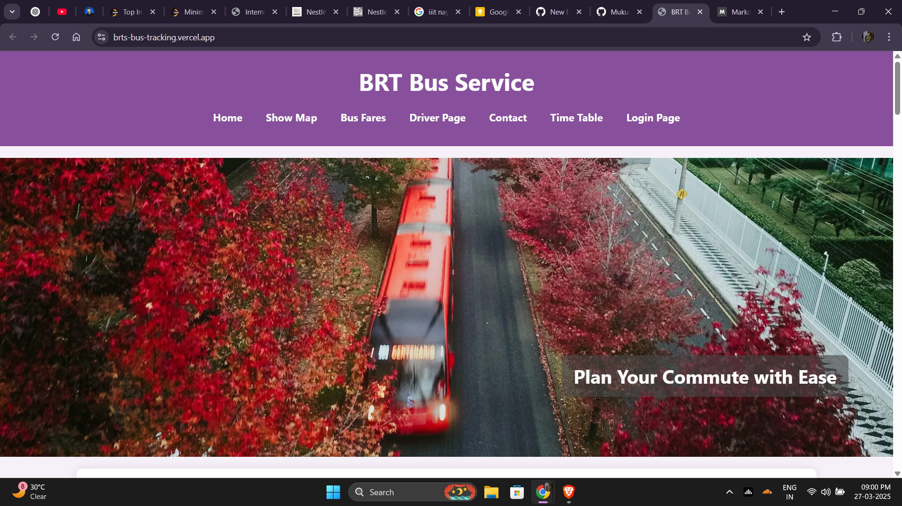

# BRT Bus Service System



A modern and intuitive bus service system designed specifically for our college community. This project offers real-time bus tracking, comprehensive fare details, and timetables—all through a beautifully designed interface. Developed as a minor project in my 3rd semester of the 2nd year, it continues to evolve based on user feedback.

## Table of Contents

- [Tech Stacks](#tech-stacks)
- [Features](#features)
- [Demo](#demo)
- [Installation](#installation)
- [Usage](#usage)
- [Contributing](#contributing)
- [License](#license)
- [Notes](#notes)

## 🔧 Tech Stacks

- **Frontend:** HTML, CSS, and JavaScript  
- **Backend:** Deployed on [Render.io](https://render.com) for handling real-time tracking data

## ✨ Features

- **Real-Time Bus Tracking:**  
  Drivers can select a bus number and share their location every 5 seconds. Passengers can then check the respective bus number to see its live location.

- **Comprehensive Bus Details:**  
  Provides detailed bus fare information and timetables to help users plan their commutes efficiently.

- **User-Friendly Interface:**  
  Designed to be both visually appealing and easy to use, ensuring a smooth experience for all users.

- **Community-Centric Design:**  
  Initially built for the college community, the system is continuously updated based on user feedback to meet real-world commuting needs.

## 🚀 Demo

[View Live Demo](https://brts-bus-tracking.vercel.app/) 

## 🛠️ Installation

### 1. Clone the Repository

```bash
git clone https://github.com/YourUsername/BRT-Bus-Service-System.git
cd BRT-Bus-Service-System
```

### 2. Open the Application

Simply open the `index.html` file in your web browser.

## 📚 Usage

- **For Drivers:**  
  Navigate to the driver portal, choose the appropriate bus number, and enable location sharing (updates every 5 seconds).

- **For Passengers:**  
  Enter the bus number you wish to track to see its live location along with fare details and timetable information.

## 🤝 Contributing

Contributions are welcome! To contribute:

1. **Fork the Repository**
2. **Create a Feature Branch:**  
   `git checkout -b feature/YourFeature`
3. **Commit Your Changes:**  
   `git commit -m "Add feature description"`
4. **Push to the Branch:**  
   `git push origin feature/YourFeature`
5. **Open a Pull Request**

## 📄 License

This project is licensed under the MIT License. See the [LICENSE](LICENSE) file for details.

## 📝 Notes

This project was built using only HTML, CSS, and JavaScript, with the backend deployed on Render.io to support real-time tracking. It was developed during my 3rd semester in the 2nd year to improve the commuting experience for our college community. Feedback and suggestions are highly encouraged as the project evolves.
```
